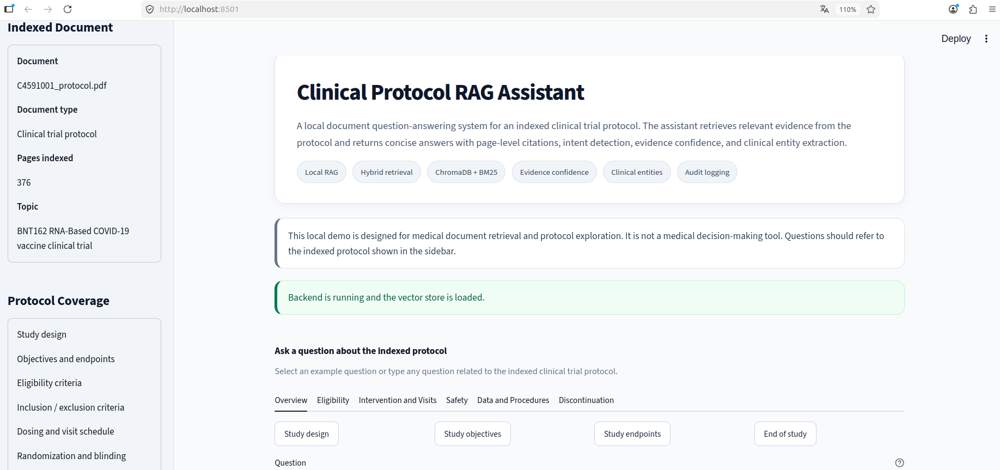
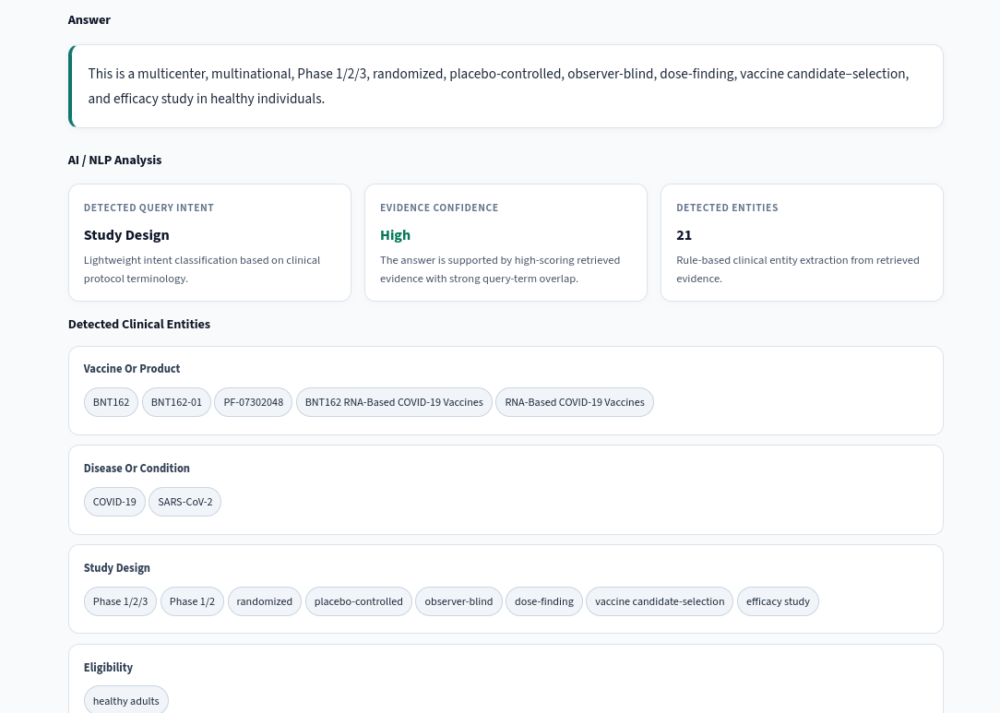

# Clinical Protocol RAG Assistant

Local AI/RAG assistant for clinical trial protocol question answering.

The system indexes a clinical trial protocol PDF and allows users to ask natural language questions about study design, eligibility criteria, dosing schedules, safety monitoring, adverse events, and follow-up procedures.

Local application after setup: http://localhost:8501     
Protocol source: https://www.nejm.org/doi/suppl/10.1056/NEJMoa2034577/suppl_file/nejmoa2034577_protocol.pdf

This is a personal portfolio project and a local medical document exploration prototype. It is not intended for clinical decision-making.


## Screenshots

### Application Overview



### Answer and AI/NLP Analysis




## Key Features

- Hybrid RAG retrieval using ChromaDB semantic search and BM25 keyword search
- Evidence-based answers generated from retrieved protocol passages
- Page-level citations with source pages and retrieval scores
- Query intent detection
- Evidence confidence estimation
- Lightweight clinical entity extraction
- No-answer handling for unsupported questions
- Local SQLite audit logging
- FastAPI backend
- Streamlit frontend
- Evaluation and API test scripts

## Technology Stack

- Python
- FastAPI
- Streamlit
- LangChain
- ChromaDB
- Sentence Transformers
- BM25
- SQLite
- Docker

## Protocol PDF

The protocol PDF is not included in this repository due to file size and licensing considerations.

To run the project locally, download the public protocol PDF from:

https://www.nejm.org/doi/suppl/10.1056/NEJMoa2034577/suppl_file/nejmoa2034577_protocol.pdf

Then place it at:

```text
data/raw/C4591001_protocol.pdf
```

## Local Setup

Clone the repository:

```bash
git clone https://github.com/zoiiliadou/clinical-protocol-rag-assistant.git
cd clinical-protocol-rag-assistant
```

Create and activate a virtual environment:

```bash
python3 -m venv venv
source venv/bin/activate
```

Install dependencies:

```bash
pip install -r requirements.txt
```

Run ingestion:

```bash
python src/ingest.py
```

Start the FastAPI backend:

```bash
uvicorn app.api.main:app --reload
```

Start the Streamlit frontend in a second terminal:

```bash
streamlit run frontend/streamlit_app.py
```

Open the application:

```text
http://localhost:8501
```

## Docker Setup

The project can also be run with Docker.

Before running Docker, download the public clinical trial protocol PDF and place it at:

```text
data/raw/C4591001_protocol.pdf
```

Build the Docker image:

```bash
docker compose build
```

Run ingestion inside Docker:

```bash
docker compose run --rm --no-deps api python src/ingest.py
```

Start the FastAPI backend and Streamlit frontend:

```bash
docker compose up --no-build
```

Open the Streamlit application locally:

```text
http://localhost:8501
```

The FastAPI documentation is available at:

```text
http://localhost:8000/docs
```

The protocol PDF, vector store, local cache, and audit database are not included in the repository.

## Usage

Ask a question from the CLI:

```bash
python src/ask.py "What is the dosing schedule?"
```

Run evaluation:

```bash
python evaluation/run_evaluation.py
```

Run API tests while the backend is running:

```bash
python evaluation/api_test.py
```

## Disclaimer

This software is designed strictly as a personal portfolio project and local prototype. It does not replace professional medical advice, clinical diagnosis, clinical trial review, regulatory evaluation, or human expert judgment.
